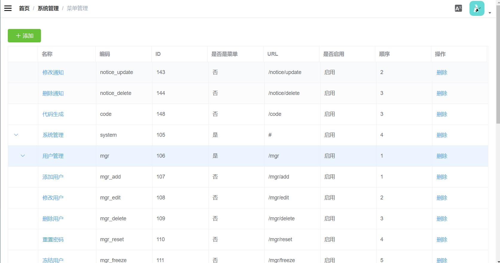
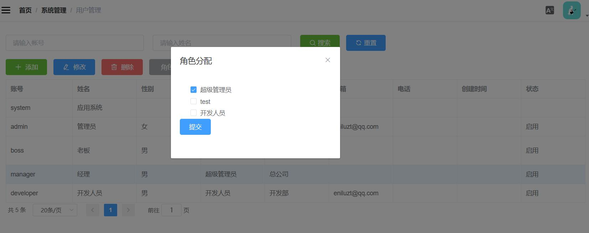

# 权限管理
vue版本的后台管理和普通版后台管理的权限管理思路是基本一致的。


## 权限配置
权限管理的核心为控制角色对菜单和按钮的访问，所以权限配置主要包含以下内容的维护:

- 菜单管理： 维护要控制的页面菜单和按钮

- 角色管理： 为角色配置可以访问的菜单和按钮

- 用户管理： 为用户配置角色


## 权限控制
权限的实现步骤如下：
- 配置拦截器
- 左侧菜单导航的权限控制（页面权限控制和路由生成）
- 页面功能的权限控制（按钮权限控制）

 ## 配置拦截器

 cn.enilu.flash.api.config.WebAppConfig 中配置拦截器，拦截要过滤的请求地址，参考代码

 ```java
 @Configuration
public class WebAppConfig extends WebMvcConfigurerAdapter {
    /**
     * 定义排除拦截路径
     */
    public String[] EXCLUDE_PATH_PATTERN = {
            "/file/**",//文件上传和下载
            "/offcialSite","/offcialSite/*",//h5端的api，建议生产中将前端h5和后端h5使用的api分拆成两个服务，
            "/druid/**",//druid监控请求
            "/validate/*",//验证码地址
            "/account/register", "/account/login",//用户注册和登陆
            "/error",//错误资源
            "/swagger-resources","/v2/api-docs","/swagger-ui.html","/webjars/**"//swagger在线api文档资源
    };

    /**
     * 注册自定义拦截器，添加拦截路径和排除拦截路径
     * @param registry
     */
    @Override
    public void addInterceptors(InterceptorRegistry registry) {
        registry.addInterceptor(new SecurityInterceptor()).addPathPatterns("/**").excludePathPatterns(EXCLUDE_PATH_PATTERN);

    }
}
``` 

## 左侧菜单导航的权限控制
用户登陆成功后，会根据用户所拥有的角色配置的菜单生成路由表数据返回到前端：cn.enilu.flash.api.controller.AccountController：
```java
//获取用户可以操作的菜单列表
List menus = menuRepository.getMenusByRoleIds(shiroUser.getRoleList());
map.put("menus",menus);
```
前端接收到菜单列表信息后根据是否有这些菜单列表的操作权限来生成路由表：src/store/modules/permission.js：

```javascript

/**
 * 通过route.path判断用户是否有对改菜单的操作权限
 * @param roles
 * @param route
 */
function hasMenu(menus, route) {
  if (route.path) {
    return menus.some(menu => (menu[4].indexOf(route.path) >= 0) )
  } else {
    return true
  }
}

/**
 * 递归过滤异步路由表，返回后台菜单列表包含的路由表
 * @param asyncRouterMap
 * @param menus
 * @returns {*}
 */
function filterAsyncRouterByMenu(asyncRouterMap, menus) {
  const accessedRouters = asyncRouterMap.filter(route => {
    if (hasMenu(menus, route)) {
      if (route.children && route.children.length) {
        route.children = filterAsyncRouterByMenu(route.children, menus)
      }
      return true
    }
    console.log(route.path)
    return false
  })
  return accessedRouters
}
```


## 页面功能（按钮）的权限控制

页面按钮的控制用到[vue-element-admin](https://github.com/PanJiaChen/vue-element-admin)封装的一个指令权限[v-permission](https://github.com/PanJiaChen/vue-element-admin/tree/master/src/directive/permission)，具体用法如下：
```html
<el-button type="success" icon="el-icon-plus" @click.native="add" v-permission="['/mgr/add']">
           {{$t('button.add') }}
</el-button>
<el-button type="primary" icon="el-icon-edit" @click.native="edit" v-permission="['/mgr/edit']">
 {{$t('button.edit') }}
</el-button>
<el-button type="danger" icon="el-icon-delete" @click.native="remove" v-permission="['/mgr/delete']">
 {{$t('button.delete') }}
</el-button>
```  
